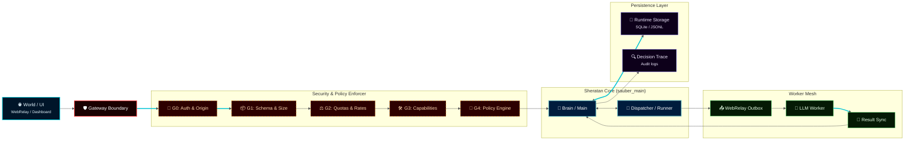

```mermaid
flowchart LR
    %% Node Definitions
    W["🌐 World / UI<br/><small>WebRelay / Dashboard</small>"]:::world
    G["🛡️ Gateway Boundary"]:::gate
    
    subgraph GATES ["Security & Policy Enforcer"]
        direction TB
        G0["🚫 G0: Auth & Origin"]:::gate_step
        G1["📦 G1: Schema & Size"]:::gate_step
        G2["⚖️ G2: Quotas & Rates"]:::gate_step
        G3["🛠️ G3: Capabilities"]:::gate_step
        G4["📜 G4: Policy Engine"]:::gate_step
        G0 --> G1 --> G2 --> G3 --> G4
    end

    subgraph CORE ["Sheratan Core (sauber_main)"]
        C["🧠 Brain / Main"]:::core
        R["🚦 Dispatcher / Runner"]:::core
        C <--> R
    end

    subgraph DB ["Persistence Layer"]
        D["💾 Runtime Storage<br/><small>SQLite / JSONL</small>"]:::data
        T["🔍 Decision Trace<br/><small>Audit logs</small>"]:::data
    end

    subgraph WORK ["Worker Mesh"]
        WR["📤 WebRelay Outbox"]:::work
        LLM["🤖 LLM Worker"]:::work
        S["🔄 Result Sync"]:::work
    end

    %% Connections
    W ==> G
    G --> G0
    G4 ==> C
    C <--> D
    R ==> WR
    WR --> LLM
    LLM --> S
    S ==> C
    C --> T

    %% Style Definitions
    classDef world fill:#001529,stroke:#00c3d4,color:#e6f7ff,stroke-width:2px
    classDef gate fill:#1a0000,stroke:#ff4d4d,color:#fff,stroke-width:2px
    classDef gate_step fill:#2d0000,stroke:#ff8c00,color:#ffd8b1,stroke-dasharray: 5 5
    classDef core fill:#001c3d,stroke:#4aa3b5,color:#fff,stroke-width:2px
    classDef work fill:#051a05,stroke:#4ee36a,color:#e6ffe6,stroke-width:1px
    classDef data fill:#0d001a,stroke:#8b7cff,color:#f0eaff,stroke-width:1px

    %% Link Styling
    linkStyle default stroke:#555,stroke-width:1px
    linkStyle 0,6,8,11 stroke:#00c3d4,stroke-width:3px
```
