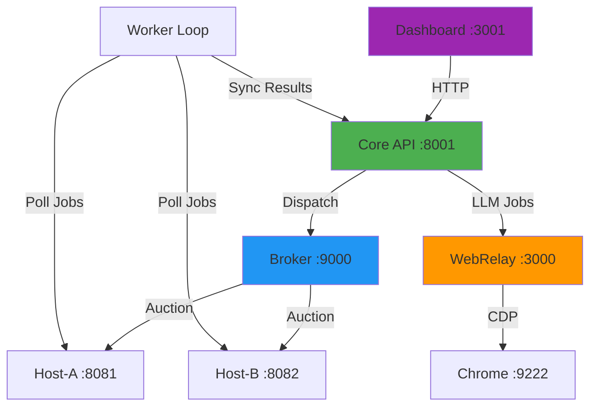

# Sheratan System Overview & Port Guide

## Quick Answer: IDE Integration

**Ja, du kannst das System über die IDE steuern!** Die IDE kann:
- ✅ Terminals öffnen und Commands ausführen (wie gerade mit `START_COMPLETE_SYSTEM.bat`)
- ✅ HTTP-Requests an alle Services senden
- ✅ Logs in Echtzeit anzeigen
- ✅ Browser-Automation für UI-Tests durchführen

---

## Complete Port Map

### Core Services (Always Running)

| Port | Service | Purpose | Health Check |
|------|---------|---------|--------------|
| **8001** | **Core API** | Mission/Task/Job orchestration, State Machine, Dispatcher | `GET /api/system/state` |
| **9000** | **Broker** | Mesh job auction & routing | `GET /health` |
| **3000** | **WebRelay** | LLM bridge (Chrome CDP → Core) | `GET /health` |
| **9222** | **Chrome Debug** | CDP endpoint for WebRelay | Chrome DevTools Protocol |

### Worker Nodes

| Port | Service | Purpose | Health Check |
|------|---------|---------|--------------|
| **8081** | **Host-A** | Offgrid worker node A | `GET /health` |
| **8082** | **Host-B** | Offgrid worker node B | `GET /health` |
| **N/A** | **Worker Loop** | Job processor (no HTTP) | Check logs |

### Frontend

| Port | Service | Purpose | URL |
|------|---------|---------|-----|
| **3001** | **Dashboard** | Mission Control UI | http://localhost:3001 |

---

## Service Architecture



---

## Key API Endpoints

### Core API (Port 8001)

#### System State & Health
```http
GET  /api/system/state              # Current system state
POST /api/system/state/transition   # Trigger state transition
GET  /api/system/state/history      # State transition history
GET  /api/health                    # Health check
```

#### Missions, Tasks, Jobs
```http
GET    /api/missions                # List all missions
POST   /api/missions                # Create mission
GET    /api/missions/{id}           # Get mission details
DELETE /api/missions/{id}           # Delete mission

POST   /api/missions/{id}/tasks     # Create task
GET    /api/tasks                   # List all tasks

POST   /api/tasks/{id}/jobs         # Create job
GET    /api/jobs                    # List all jobs
GET    /api/jobs/{id}               # Get job details
POST   /api/jobs/{id}/sync          # Sync job result
```

#### Explainability (WHY-API)
```http
GET /api/why/latest?intent={intent}  # Latest decision for intent
GET /api/why/trace/{trace_id}        # Full decision trace
GET /api/why/job/{job_id}            # Job → trace mapping
GET /api/why/stats                   # Decision statistics
```

#### Diagnostics & Metrics
```http
GET /api/diagnostics/status          # Self-diagnostic status
GET /api/diagnostics/anomalies       # Recent anomalies
GET /api/metrics/baseline            # Performance baselines
```

---

## IDE Control Examples

### 1. Check System State
```powershell
# Quick health check
Invoke-RestMethod http://localhost:8001/api/system/state

# Formatted output
(Invoke-RestMethod http://localhost:8001/api/system/state) | ConvertTo-Json -Depth 5
```

### 2. Create a Mission
```powershell
$mission = @{
    title = "Test Mission"
    description = "Testing from IDE"
    priority = "normal"
} | ConvertTo-Json

Invoke-RestMethod -Method Post -Uri http://localhost:8001/api/missions -Body $mission -ContentType "application/json"
```

### 3. Monitor Jobs
```powershell
# List all jobs
Invoke-RestMethod http://localhost:8001/api/jobs | ConvertTo-Json -Depth 3

# Watch pending jobs
while ($true) {
    $jobs = Invoke-RestMethod http://localhost:8001/api/jobs
    $pending = $jobs | Where-Object { $_.status -eq "pending" }
    Write-Host "Pending: $($pending.Count)" -ForegroundColor Yellow
    Start-Sleep 2
}
```

### 4. Check Decision Traces
```powershell
# Latest decision for an intent
Invoke-RestMethod "http://localhost:8001/api/why/latest?intent=dispatch_job"

# Get stats
Invoke-RestMethod http://localhost:8001/api/why/stats | ConvertTo-Json -Depth 5
```

---

## Docker Integration (From Your Screenshot)

Ich sehe du hast **Docker Desktop** mit `sheratan-gateway` laufen. Das ist vermutlich ein zusätzlicher Service:

### Sheratan Gateway
- **Image**: `sheratan-gateway:latest`
- **Purpose**: Wahrscheinlich API Gateway oder Reverse Proxy
- **Created**: 24 days ago
- **Size**: 343.63 MB

**Frage**: Ist das ein separater Gateway-Service? Falls ja, auf welchem Port läuft der?

---

## Recommended Documentation Files

### Already Existing (Check These!)

1. **`README.md`** - Main project overview
2. **`QUICKSTART.md`** - Quick start guide
3. **`docs/`** - Documentation folder (20 files!)

### Key Docs to Check
```powershell
# List all docs
Get-ChildItem c:\sauber_main\docs -Recurse -File | Select-Object Name, Length
```

Wahrscheinlich relevante Docs:
- `docs/ARCHITECTURE.md` - System architecture
- `docs/API.md` - API reference
- `docs/DEPLOYMENT.md` - Deployment guide
- `docs/MESH.md` - Mesh network details

---

## Quick Diagnostic Commands

### Check All Services
```powershell
# Test all ports
$ports = @(8001, 9000, 3000, 3001, 8081, 8082, 9222)
foreach ($port in $ports) {
    try {
        $response = Invoke-WebRequest "http://localhost:$port" -TimeoutSec 1 -UseBasicParsing
        Write-Host "✅ Port $port - OK" -ForegroundColor Green
    } catch {
        Write-Host "❌ Port $port - DOWN" -ForegroundColor Red
    }
}
```

### View Live Logs
```powershell
# Core API logs
Get-Content c:\sauber_main\logs\state_transitions.jsonl -Tail 20 -Wait

# Decision traces
Get-Content c:\sauber_main\logs\decision_trace_v1.jsonl -Tail 10 -Wait
```

---

## Next Steps

1. **Check existing docs**: `Get-ChildItem c:\sauber_main\docs`
2. **Open Dashboard**: http://localhost:3001 (wait ~60s for startup)
3. **Verify State**: `Invoke-RestMethod http://localhost:8001/api/system/state`

**Soll ich dir die vorhandenen Docs durchsuchen und eine Zusammenfassung erstellen?**
