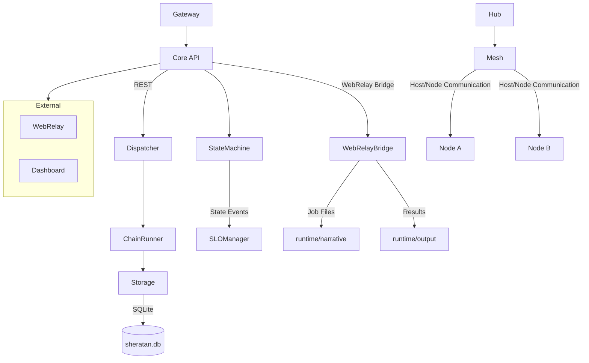

# Sheratan Core – Desired (Soll) State Documentation

---
## Overview
The **Sheratan** system is a modular, autonomous orchestration platform consisting of several core components that collaborate to execute missions, tasks, and jobs. The desired (Soll) state defines a clean, well‑documented architecture, clear responsibilities, and explicit inter‑component communication pathways.

---
## Desired Architecture

---
## Component Responsibilities
| Component | Responsibility | Key Classes / Modules |
|-----------|----------------|-----------------------|
| **Core** | Exposes the unified HTTP API (`/api/...`) for missions, tasks, jobs. Handles authentication, rate‑limiting, and health checks. | `core.main`, `core.health`, `core.rate_limiter` |
| **Dispatcher** | Central priority queue, decides which jobs to dispatch to the WebRelay bridge. Handles back‑pressure and lease management. | `core.dispatcher.Dispatcher` |
| **ChainRunner** | Turns *specifications* (chain specs) into concrete `Job` objects. Claims specs, writes jobs to the runtime directory. | `core.chain_runner.ChainRunner` |
| **StateMachine** | Tracks the overall system state (STARTING, RUNNING, SHUTDOWN). Emits events for SLO monitoring. | `core.state_machine.SystemStateMachine` |
| **SLOManager** | Monitors Service‑Level‑Objectives (queue depth, latency, error rates) and raises alerts. | `core.slo_manager.SLOManager` |
| **WebRelay Bridge** | Persists incoming job requests to `runtime/narrative`, reads results from `runtime/output`, and forwards them to the LLM worker. | `core.webrelay_bridge.WebRelayBridge` |
| **Mesh** | Provides a peer‑to‑peer overlay for off‑grid hosts. Handles host discovery, health probing, and weighted routing. | `mesh.core`, `mesh.offgrid.host.heartbeat` |
| **Hub** | Orchestrates the Mesh and acts as a gateway for external nodes. | `hub.main` |
| **Gateway** | Validates and forwards API calls to the Core, applying policy checks. | `core.gateway_middleware` |
| **Dashboard** | Static UI for monitoring system health and job status. | `external/dashboard/dist/*` |

---
## Key Utility Functions (Desired)
| Module | Function | Purpose |
|--------|----------|---------|
| `core.utils.atomic_io` | `atomic_write_json` | Write JSON files atomically with durability guarantees. |
| `core.utils.atomic_io` | `atomic_append_jsonl` | Append a JSON line to a `.jsonl` log safely. |
| `core.utils.atomic_io` | `canonical_json_bytes` | Produce deterministic JSON bytes for hashing. |
| `core.utils.atomic_io` | `sha256_hex` | Compute SHA‑256 hash of bytes. |
| *TODO* | `walk_tree` | Recursively walk a directory tree and yield file paths. |
| *TODO* | `write_file` | Simple helper to write text/binary data to a file with optional atomicity. |

---
## Data Flow – Mission → Task → Job → Trace
1. **Mission Creation** – Client POST `/api/missions` → Core stores mission in DB, returns `mission_id`.
2. **Task Creation** – Client POST `/api/missions/{mission_id}/tasks` → Core stores task, returns `task_id`.
3. **Job Creation** – Client POST `/api/tasks/{task_id}/jobs` → Core stores job, returns `job_id`.
4. **Trace Generation** – Each API call creates a **DecisionTrace** entry (`normalize_trace_*` functions) that links the three IDs together, enabling end‑to‑end observability.
5. **Dispatch** – Dispatcher picks pending jobs, writes them via `WebRelayBridge` to `runtime/narrative`.
6. **Execution** – LLM worker reads the job file, performs the action, writes results to `runtime/output`.
7. **Result Ingestion** – Core polls `runtime/output`, updates job status, and emits trace updates.

---
## Port Assignments (Desired)
| Service | Default Port | Config Variable |
|---------|--------------|-----------------|
| Core API (FastAPI) | 8000 | `SHERATAN_CORE_PORT` |
| WebRelay (HTTP) | 8001 | `SHERATAN_WEBRELAY_PORT` |
| Dashboard (static) | 8002 | `SHERATAN_DASHBOARD_PORT` |
| Mesh Probe | 8003 | `SHERATAN_MESH_PROBER_PORT` |
| Hub (Broker) | 8004 | `SHERATAN_HUB_PORT` |

*Note: The actual ports are currently defined via environment variables in `core/config.py`. Verify they match the values above.*

---
## TODO – Differences Between Desired (Soll) and Current (Ist) State
- **Missing Utility Functions**: `walk_tree` and `write_file` are referenced in documentation but do not exist in the codebase. Implement them in `core/utils/`.
- **Port Configuration**: No explicit port constants are defined; the system relies on environment variables only. Add a central `PORTS` config section in `core/config.py`.
- **Component Diagrams**: No mermaid diagram file currently exists. Add `docs/components_diagram.mmd` and reference it from the README.
- **Function Reference Table**: A comprehensive table of all public utility functions is missing. Generate `docs/function_reference.md`.
- **Trace Normalization**: Functions `normalize_trace_state`, `normalize_trace_action`, `normalize_trace_result` exist, but the linking of `mission_id → task_id → job_id` is not fully documented in the code. Add comments and unit tests.
- **SLO Monitoring**: ✅ **COMPLETED** - `SLOManager` is wired into the FastAPI lifespan (line 607 in `core/main.py`).
- **Mesh Weights Normalization**: The method `MeshConfig.normalized_weights` is present, but the actual usage in routing logic is incomplete. Ensure the router consumes normalized weights.
- **Documentation Links**: The repository `README.md` does not link to the new documentation files. Update it accordingly.
- **Static Dashboard Build**: The `external/dashboard/dist` folder contains compiled assets, but there is no script to rebuild them. Add a `npm run build-dashboard` helper.
- **Testing Coverage**: No tests cover the new utility functions or the trace creation flow. Add unit tests in `tests/`.

---
## Next Steps
1. Implement the missing utility functions (`walk_tree`, `write_file`).
2. Add a central port configuration in `core/config.py`.
3. Create the mermaid diagram and function reference markdown files.
4. Wire `SLOManager` into the FastAPI lifecycle.
5. Update the README with links to the new docs.
6. Write unit tests for the new utilities and trace flow.

---
*This document captures the intended target state of the Sheratan Core system and highlights concrete TODO items required to bridge the gap from the current implementation.*
