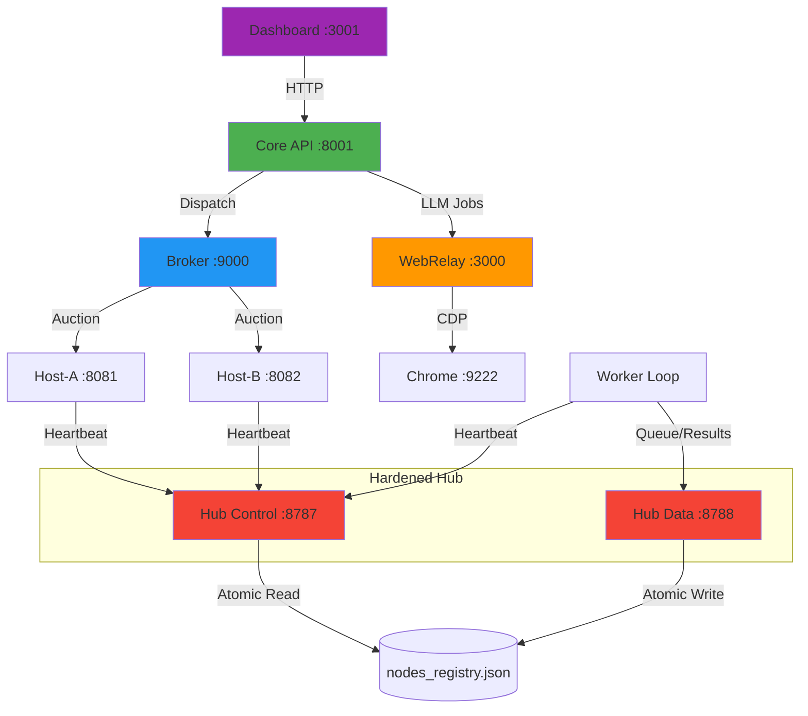

# Sheratan System Overview & Port Guide

## Quick Answer: IDE Integration

**Ja, du kannst das System über die IDE steuern!** Die IDE kann:
- ✅ Terminals öffnen und Commands ausführen (wie gerade mit [START_COMPLETE_SYSTEM.bat](file:///c:/sauber_main/START_COMPLETE_SYSTEM.bat))
- ✅ HTTP-Requests an alle Services senden
- ✅ Logs in Echtzeit anzeigen
- ✅ Browser-Automation für UI-Tests durchführen

---

## Complete Port Map

### Hub Services (Hardened Mesh)

| Port | Service | Purpose | Health Check |
|------|---------|---------|--------------|
| **8787** | **Hub Control** | Heartbeats, Registry, Bundle Access | `GET /health` (Public) |
| **8788** | **Hub Data** | Job Queues, Results, Admin Path | `GET /health` (Localhost) |

---

## Service Architecture



---

## Hardening Runbook

### 1. Environment Variables (Required)
| Variable | Default | Purpose |
|----------|---------|---------|
| `SHERATAN_HUB_TOKEN` | `shared-secret` | Mandatory secret for mesh communication. |
| `SHERATAN_HUB_TOKEN_REQUIRED` | `1` | Enforces 403 on missing/invalid tokens. |
| `SHERATAN_NODE_TTL_SEC` | `120` | Seconds until a node is marked **STALE**. |
| `SHERATAN_NODE_DEAD_SEC` | `600` | Seconds until a node is marked **DEAD**. |

### 2. Operational Checks (Smoke Suite)
Run the automated checklist to verify port isolation and security:
```powershell
.\smoke_checks.ps1
```

### 3. Failure Modes & Recovery
- **"AUTH_FAIL" in worker logs**: Double-check `SHERATAN_HUB_TOKEN` matches on both Hub and Worker.
- **"PORT_MISMATCH" in audit log**: A client is trying to pull jobs from 8787 or send heartbeats to 8788. Verify client configuration.
- **Node is STALE**: Verify if CPU is pegged or network latency is high. Heartbeat interval should be ~10-15s.
- **Registry Corruption**: The system uses `write_atomic`. If `nodes_registry.json` is lost, it will self-repopulate as nodes send their next heartbeats.

### 4. Security Audit
Audit logs are stored in:
`C:\gemmaloop\.sheratan\logs\hub_security_audit.jsonl`
*(Check for `event: AUTH_FAILURE` to identify unauthorized access attempts.)*
